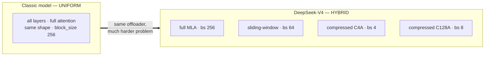
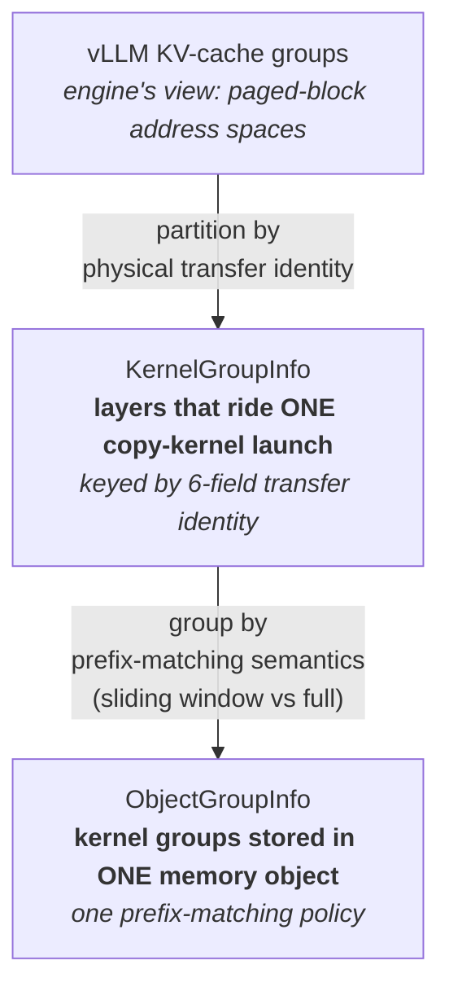
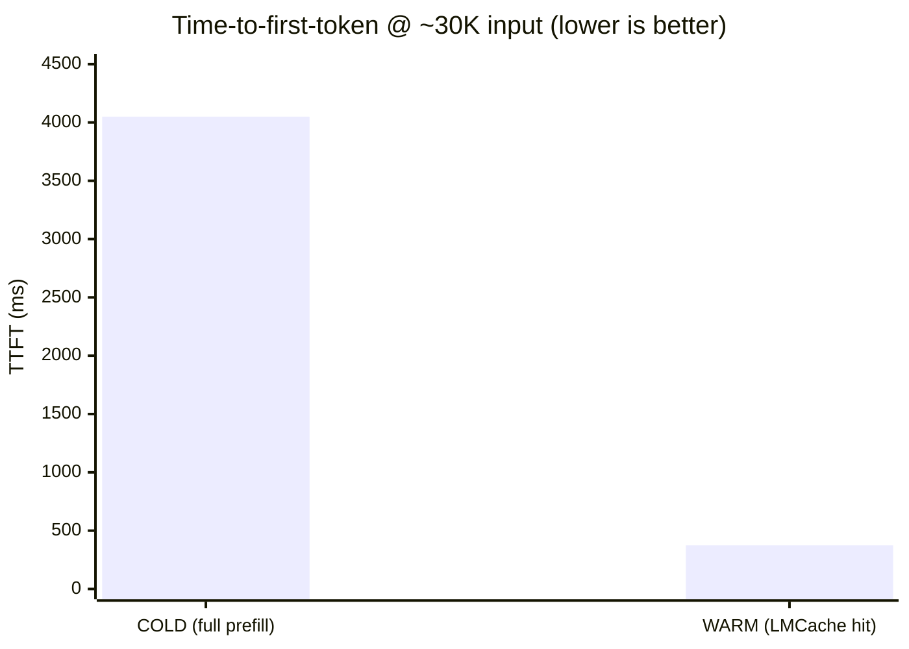

Large-context LLM serving lives and dies by the KV cache. When a request shares a
long prefix with an earlier one — a system prompt, a RAG document, a multi-turn
history — recomputing that prefix's attention from scratch is pure waste.

LMCache eliminates that waste by offloading KV cache to external storage and streaming it back on a prefix hit, so prefill is
skipped entirely for the cached portion. DeepSeek V4 tackles it another way: it compresses the prefix tokens by either **4x** or **128x**, saving it on storage and transfer. Combining the two - caching and compression - is great, but it's no easy thing.

For most models it is simple: the KV cache is a uniform stack of
identically-shaped and identically-layered tensors, organized into fixed-size blocks of tokens. You get the token prefix, copy out the blocks, and copy them back later.

**DeepSeek-V4 breaks every assumption that simplicity rests on.** Supporting it forced us to rethink how we model the KV cache of a model from the ground up.
This post walks through three problems we hit — vLLM's hybrid memory
allocator, the kernel-group/object-group split, and sliding-window optimization —
and how we resolved them. We close with measured numbers: at a 30K-token
input, a warm prefix hit collapses time-to-first-token by **~10.8×** on Nvidia H20.

---

## Background: DeepSeek V4 doesn't have a uniform KV cache

A "classic" transformer KV cache looks like this:

- Every layer attends over the **full** context.
- Every layer's KV tensor has the **same shape**.
- The cache is paged into blocks of a **single** `block_size` (say, 256 tokens).
- There is **one** unified block-ID address space shared by all layers.

DeepSeek-V4 is a hybrid-attention model designed for million-token context, and it
violates all four:

1. **Multiple attention types.** V4 mixes full attention
   layers with **sliding-window** attention layers. A full-attention layer reads the whole
   prefix; a sliding-window layer only attends to a recent window of fixed size (the last 256 tokens, for example).

2. **Compressed KV states with different shapes.** DeepSeek V4's Compressed Sparse Attention keeps compressed KV caches, which have different per-token byte sizes than the uncompressed ones. What's more, the Compressed Sparse Attention layers even come in two different compression ratios.

3. **Different block sizes per group.** Per-token byte sizes differ across layers, and vLLM still wants every layer's block to occupy a similar number of bytes — so it varies the number of tokens per block. The full-MLA layers page at block_size=256; the sliding-window state caches page at 4, 8, or 64. A single global block size no longer exists.

4. **Multiple independent block-ID spaces.** Because vLLM allocates these heterogeneous layers into separate groups (so it can apply different eviction strategies to different layers), each token can have several block IDs.



<p align="center"><em>Figure 1 — A classic KV cache is one shape, one block size, one
address space. V4 is many of each.</em></p>

---

## Challenge 1: vLLM's Hybrid Memory Allocator (HMA)

**Why does vLLM bother with a hybrid allocator at all?** Because a uniform pool wastes
enormous memory on a hybrid model. If every layer paged at a single `block_size`, the
sliding-window layers would each reserve a full prefix's worth of blocks — even though
they only ever read the last *W* tokens. The hybrid allocator instead gives each kind
of layer its own paged-block address space, so a sliding-window group can aggressively
recycle blocks that fall outside its window while a full-attention group holds
everything — all sharing the same physical buffer pool through clever aliasing. On
`DeepSeek-V4-Flash` the difference is stark: with the hybrid manager **off**, vLLM
fits only ~4.6× the model's batch of concurrent 32K-token requests; with it **on**,
~15.2× — roughly **3× more concurrency from the same GPU memory**. A unified cache
space simply can't do that.

So vLLM's hybrid KV cache manager is what makes V4 fit in GPU memory in the first
place. It creates several KV-cache groups, each describing a set of layers with a
common spec, and gives each group its **own paged-block address space**.

The catch for an offloader: **block IDs are only meaningful within one group.** When
vLLM hands LMCache "the blocks for this request," it's really handing over *N*
independent lists, one per group, each indexing into a different address space.
LMCache's original design assumed a single list against a single space. Feeding
multi-group block IDs into that assumption silently corrupts which bytes get copied.

The fix was a real interface, not a patch. On the vLLM side, the connector declares it
implements hybrid-memory support; on the LMCache side, we built a data model that
mirrors vLLM's group structure exactly so that both ends agree, layer-for-layer, on
which block ID belongs to which address space. The most important field that
makes this work is an **engine group index** stamped onto every layer — it is what
keeps two layers with byte-identical tensor shapes from being merged when they
actually live in disjoint block-ID spaces.

### For the curious: how vLLM allocates these tensors (skippable)

Concretely, on a `DeepSeek-V4-Flash` deployment (tp=4, fp8, `block_size=256`), vLLM
hands LMCache **167 per-layer KV tensors**. They add up that way because a single V4
layer can own *several* distinct caches, depending on its compression scheme:

- **21 CSA (4×) layers** each carry **four** caches — main MLA KV, an indexer key
  cache, and two compressor-state caches (main + indexer) → **84 tensors**.
- **20 HCA (128×) layers** each carry **two** — main MLA KV and one compressor-state
  cache → **40 tensors**.
- **43 sliding-window caches**, one per layer that keeps a recent-window KV →
  **43 tensors**.

That's 84 + 40 + 43 = **167**, in **7 distinct per-layer shapes** (head size, dtype,
and block size all vary), partitioned into **5 KV-cache group specs**.

Here's the part that really breaks a naïve offloader's mental model, though: those
167 tensors are *not* 167 separate allocations. Underneath, vLLM packs them into just
**66 physical buffers** — 22 "layer tuples" × 3 page sizes (1,728 / 8,640 / 37,440
bytes per block). Layers whose blocks happen to be the same byte size are **aliased**
into one shared raw buffer (up to five layers per buffer), each reading its slot
through a different stride. So a single `torch.zeros` on the GPU backs five
logically-separate "tensors," and the per-layer view LMCache receives is a
non-contiguous strided window into shared storage — which is exactly why the
strided-tensor problem in "Other sharp edges" exists in the first place.

---

## Challenge 2: kernel groups vs. object groups

Once you accept that V4's layers must be partitioned, the natural question is: *by
what?* The answer turned out to be **two different things at once**, and conflating
them was an early source of bugs. LMCache now models a KV cache in three layers:



<p align="center"><em>Figure 2 — LMCache's three-layer model. Kernel groups are the
unit of <b>transfer</b>; object groups are the unit of <b>prefix matching</b>.</em></p>

### Kernel groups: the unit of *transfer*

A **kernel group** is the set of layers that can be moved by a single GPU copy-kernel
launch sharing one shape descriptor. Membership is decided by a six-field identity:

```python
class KernelGroupIdentity(NamedTuple):
    kv_size: int          # 1 for MLA, 2 for standard K/V
    num_heads: int
    head_size: int
    block_size: int       # physical slots per paged block
    engine_group_idx: int # which paged-block address space
    dtype: torch.dtype
```

Two layers join the same kernel group **iff** all six match. The first four are
obvious — you can't run one copy kernel over tensors of different shape or element
width. The fifth, `engine_group_idx`, is the HMA fix from Challenge 1: it forbids
merging layers from different block-ID spaces even when their shapes are identical.
The sixth, `dtype`, is kept explicitly because byte-width alone can't distinguish,
say, bf16 from fp16 — and the transfer kernel is templated on the torch dtype.

A subtlety V4 forced us to handle cleanly: **logical tokens per block ≠ physical
slots per block.** A heavily-compressed state group might cover 256 logical tokens in
a paged block but occupy only a couple of physical slots. Every size calculation
therefore goes through one helper, so the kernel's per-chunk slot count is correct
for *any* compression ratio and collapses to the trivial value when there is none:

```python
def calculate_slots(self, num_tokens: int) -> int:
    # physical slots for a given logical token count
    return num_tokens * self.slots_per_block // self.tokens_per_block
```

### Object groups: the unit of *prefix matching*

An **object group** is one or more kernel groups whose KV is stored together in a
single cache object — and, critically, **share one prefix-matching policy.** This
distinction is what sliding-window support hinges on:

- **Full-attention** layers are prefix-cacheable in the ordinary way: a hit covers a
  contiguous prefix from token 0.
- **Sliding-window** layers have fundamentally different hit semantics — only the
  trailing window is ever reused.

Keeping these as separate concepts means a full-attention kernel group and a
sliding-window kernel group can share a copy kernel's *shape* (if their tensors
match) yet still be stored and matched independently. Merging the two ideas — which
an early prototype did — produces a cache that's either correct for full attention or
correct for sliding window, never both.

Why does this deserve a whole separate abstraction from the trim we're about to
describe? Because the *style* of reuse flips depending on how the window compares to a
chunk. When the window is **smaller** than a chunk (DeepSeek-V4's case), the win is
trimming *within* each chunk. When the window is **as large as or larger** than a
chunk, the win shifts to skipping whole leading chunk-objects and keeping only the
trailing ones — e.g. Google's gemma-4 has a 1024-token window against a 1024-token
chunk, so each sliding-window object group keeps just the last chunk and drops every
earlier one. The object-group abstraction is what lets one cache support both styles
cleanly, rather than baking a single policy into the storage layer.

---

## Challenge 3: Sliding-window optimization — don't cache what you'll never read

Here is the payoff that makes all the plumbing worthwhile.

A sliding-window layer with window *W* never attends beyond the last *W* tokens. So
**caching the entire prefix for that layer is wasted bandwidth and wasted memory.**
We only need the trailing window. DeepSeek-V4's sliding windows are small — its SWA
groups use windows of **8, 128, and 256 tokens** — far smaller than an LMCache chunk
(the fixed token granularity at which the cache is keyed and stored, here **1024
tokens**). So within **every** chunk we only need to store the trailing window's worth
of slots and can drop the rest.

The trim happens in two coordinated places:

1. **Block-ID trimming.** Before transfer, each sliding-window kernel group's block
   list is cut to keep only the trailing blocks of every chunk. If a chunk has 8
   blocks but the window only spans 2, we keep the last 2 and drop the rest:

   ```
   full-attention group:  [1, 2, 3, 4, 5, 6, 7, 8]   →  unchanged (needs all)
   sliding-window group:  [1, 2, 3, 4, 5, 6, 7, 8]   →  [7, 8]   (last 2 per chunk)
   ```



<p align="center"><em>Figure 3 — One chunk of 8 blocks. The full-attention group

```mermaid
flowchart TD
  subgraph FA["Full-attention group — keep everything"]
    direction LR
    f1["1"]:::keep --- f2["2"]:::keep --- f3["3"]:::keep --- f4["4"]:::keep --- f5["5"]:::keep --- f6["6"]:::keep --- f7["7"]:::keep --- f8["8"]:::keep
  end
  subgraph SW["Sliding-window group — window spans 2 blocks"]
    direction LR
    s1["1"]:::drop --- s2["2"]:::drop --- s3["3"]:::drop --- s4["4"]:::drop --- s5["5"]:::drop --- s6["6"]:::drop --- s7["7"]:::keep --- s8["8"]:::keep
  end
  classDef keep fill:#cde6cd,stroke:#2f7d32,color:#000;
  classDef drop fill:#eee,stroke:#bbb,color:#999,stroke-dasharray:3 3;
```

stores all of it; the sliding-window group stores only the trailing window (here, 2
blocks) and drops the rest — bytes the model will never read back.</em></p>

2. **Kernel slot count.** The copy kernel is then launched with the *trimmed*
   per-chunk slot count. Concretely, V4's C4A compressor-state group pages at 4
   physical slots per block with a window of just 8 tokens; instead of transferring a
   full chunk's worth of slots it moves only the trailing **8** — roughly a **128×**
   reduction in what crosses the wire for that group.

The net effect: V4's sliding-window state groups transfer a small fraction of what a
naïve full-prefix offload would, shrinking both store/load latency and memory
footprint — without ever touching the bytes the model will never read back.

---

## One more trap: strided KV tensors

V4's aliased KV layout means a layer's tensor
is often a non-contiguous strided view over a shared raw buffer. A copy kernel that
assumes a contiguous `[num_blocks, block_size, …]` layout reads garbage. The transfer
kernels learned to take an explicit per-group block stride so they walk the real
memory layout rather than an idealized one (i.e., the exact block size).

---

## Results

We validated the full path end-to-end on `DeepSeek-V4-Flash` (tp=4, fp8,
`block_size=256`) with the LMCache MP server. The registered cache resolves into 8
kernel groups with sliding-window sizes flowing through correctly — full-attention
groups report no window; sliding-window groups report their small windows, all far
below the chunk size, so the trimming path is active.

**Correctness.** On a repeated prompt, the cold request records zero
hit tokens; the warm request hits the full cached prefix, vLLM's external prefix
cache hit rate jumps from zero to a healthy fraction, and the LMCache server logs the
retrieve in milliseconds. At temperature 0, the two requests generate almost identical output — not bit-exact, since CUDA kernels aren't deterministic.

**Speedup at scale.** The real test is a large prefix. With a **~30,600-token** input
(streaming TTFT, averaged over multiple warm iterations to filter
first-hit JIT noise):

| | Time-to-first-token |
|---|---|
| **COLD** (full prefill) | ~4,050 ms |
| **WARM** (LMCache prefix hit) | ~374 ms |
| **Speedup** | **~10.8×** |



<p align="center"><em>Figure 4 — A warm LMCache prefix hit collapses TTFT from
~4,050 ms to ~374 ms — a ~10.8× speedup at 30K tokens.</em></p>

The result reproduced across independent runs, and the warm latency stayed lightning-fast at 100K+ tokens.
The prefix-cache hit collapses prefill TTFT by an **order of magnitude**.

---

## Takeaways

DeepSeek-V4 runs end-to-end on mainline LMCache today - start
the LMCache server with the vLLM server, and prefixes are cached and reused automatically.

The broader lesson generalizes well beyond one model. As frontier architectures keep
diversifying their attention — sliding windows, latent compression, per-layer
heterogeneity — a KV cache is no longer a uniform stack of tensors.
