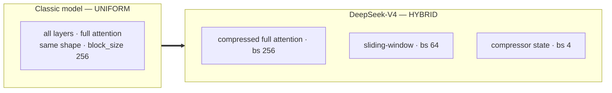
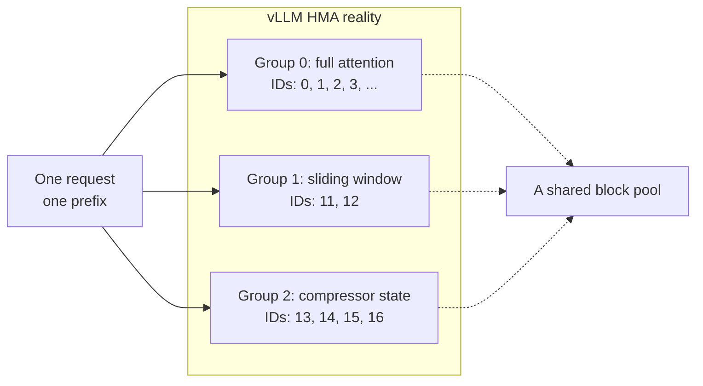
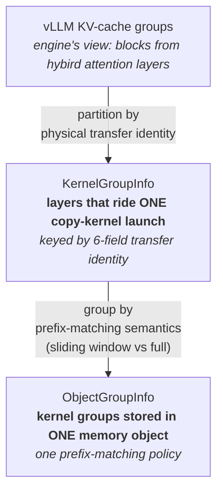
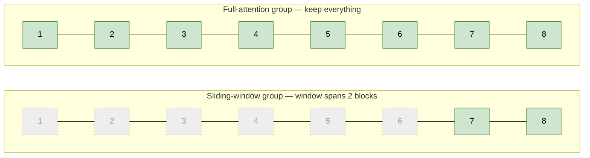
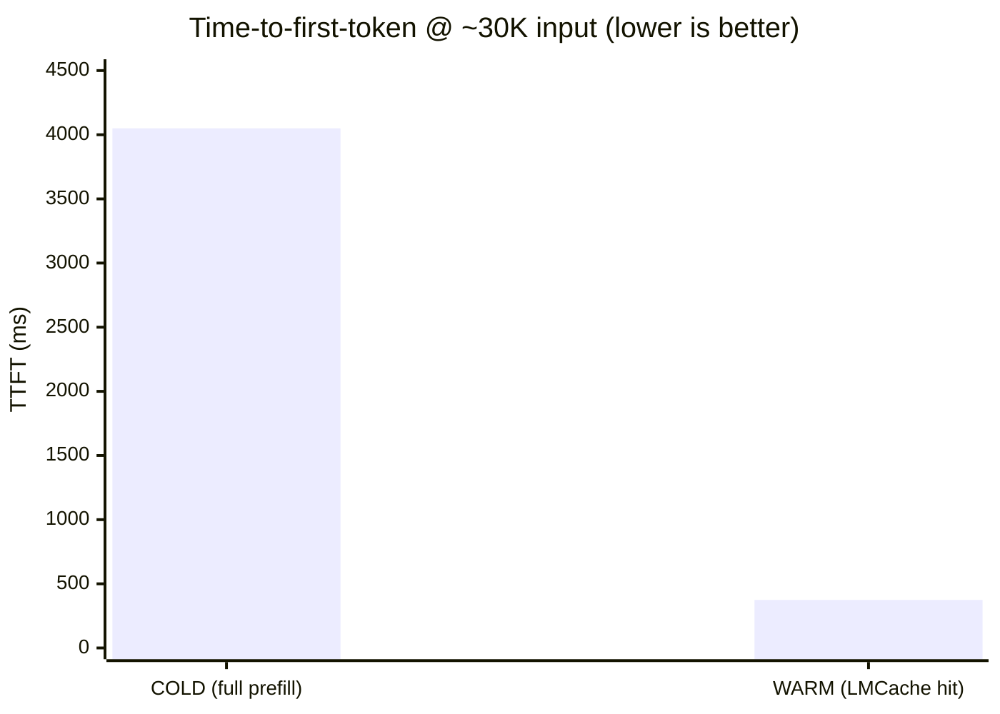

**Long-context LLM serving** lives and dies by the **KV cache**. When a request shares a
long prefix with an earlier one — be it a system prompt, RAG context,
or multi-turn history — recomputing its attention from scratch is pure waste.

One way to reduce that waste is **prefix caching**: save the KV cache to an external
storage, then load it back on a cache hit. For the cached portion of the prompt,
prefill computation can be skipped entirely. This is what **LMCache** does.

Aother approach is **compression**: make the prefix tokens smaller and hence easier
to store, move, and attend over. **DeepSeek-V4** leans heavily on this idea.

Combining the two — **caching** and **compression** — sounds ideal. But it's no easy thing in practice.

For most models, the KV cache is a uniform stack of identically shaped tensors,
organized into fixed-size token blocks. You save the blocks, copy them back later,
and you are done.

DeepSeek-V4 breaks every assumption behind that simplicity. It is a **hybrid-attention**
model: different layers use different attention patterns, own different cache shapes,
and page their caches with different block sizes. Supporting it forced us to rethink
LMCache's model of a KV cache from the ground up.

This post walks through three specific problems we hit — and how we fixed them:
vLLM's hybrid memory allocator, the kernel-group/object-group split, and
sliding-window optimization. We close with measured numbers: at a 30K-token input, a
warm prefix hit reduces time-to-first-token by **~10.8×** on Nvidia H20.

---

### Background: DeepSeek-V4 doesn't have a uniform KV cache

A "classic" transformer KV cache looks like this:

- Every layer attends over the **full prefix context**.
- Every layer's KV tensor has the **same shape**.
- The cache is paged into blocks with a **fixed block size** (say, 256 tokens).
- All layers share one **unified block-ID space**.



<p align="center"><em>Figure 1 — A classic KV cache is one shape, one block size, one
address space. V4 is many of each.</em></p>

DeepSeek-V4 is a hybrid-attention model designed for a million-token context, and it
violates all four assumptions:

1. **Multiple attention types.** V4 mixes **full-attention** layers with
   **sliding-window** layers. A full-attention layer reads the whole prefix; a
   sliding-window layer attends only to a recent window of tokens — for example, the
   last 256.

2. **Compressed KV caches have different shapes.** DeepSeek-V4's Compressed Sparse
   Attention keeps compressed KV tensors whose shapes differ from the regular KV
   tensors, which is how they save memory. Even the compressed caches are not all the
   same: different CSA variants use different compression ratios.

3. **Different layers use different block sizes.** vLLM tries to keep each block's
   memory footprint roughly comparable, so it varies the number of tokens per block.
   CSA layers may page at `block_size=256`, while uncompressed layers page at `64`.
   A single global block size no longer exists.

4. **Multiple block-ID spaces.** vLLM allocates heterogeneous layers into separate
   groups so it can apply group-specific policies, such as different eviction rules.
   Each group manages its own blocks, which means LMCache must track
   several block-ID lists of possibly different lengths.

---

## Challenge 1: vLLM's Hybrid Memory Allocator (HMA)

**Why does vLLM need a hybrid allocator at all?** A full-attention layer must keep
the whole prefix, while a sliding-window
layer only needs the last *W* tokens. If every layer were forced into one uniform
block space, vLLM would reserve memory for the worst case everywhere, and waste a
large amount of GPU memory on SWA layers that don't need to read most of those blocks.

HMA fixes this by splitting the KV cache into **groups**. Each group contains layers
with compatible cache specs and manages its **own blocks**. That lets
a sliding-window group recycle old blocks aggressively, while a full-attention group
keeps the long prefix. On **DeepSeek-V4-Flash**, the difference is stark: roughly **3× more concurrency** from the same GPU memory. (Nvidia H20, 96GB, TP=4, 32K input)



<p align="center"><em>Figure 2 — HMA turns one request into several group-local
block-ID lists.</em></p>

LMCache's original design assumed one block-ID list against one global space. Feeding HMA's
multi-group block IDs into the LMCache server clearly corrupts it.

The fix was a real design change, not a patch. On the vLLM side, the connector declares
its supports to the hybrid memory allocator. On the LMCache side, we built a new model that
mirrors vLLM's group structure and translate that to LMCache semantics, so both ends agree layer-for-layer on which block ID belongs to which group. The key field is an **engine group index**
stamped onto every layer: it prevents two KV cache layers with identical tensor shapes
from being merged when they live in disjoint block groups.

#### For the curious: how vLLM allocates these tensors (skippable)

On a `DeepSeek-V4-Flash` deployment (tp=4, fp8, `block_size=256`), vLLM hands
LMCache 167 per-layer KV tensors.

- 21 CSA (4×) layers × 4 KV cache tensors each: main CSA, an indexer, and two
  compressor-state caches (main + indexer) = 84 tensors.
- 20 HCA (128×) layers × 2 KV cache tensors each: main HCA and its compressor-state cache
  = 40 tensors.
- 43 sliding-window layers.

Together, that is 167 tensors across 7 per-layer shapes — head size, dtype, and block
size all vary — partitioned into 5 KV-cache group specs.

The more complicated part is that tensor count is not allocation count. vLLM packs
those 167 logical tensors into 66 physical buffers: 22 "layer tuples" × 3 page sizes
(1,728 / 8,640 / 37,440 bytes per block). This 22 × 3 buffer is shared by all
five groups. The 43 sliding-window layers are split into two groups (21 + 22), each fitting into
that same 22 × 3 layout (with 1 layer of paddin for the second group).
The 21 CSA layers, together with their indexer caches, are
packed alongside the 20 HCA layers. To fit the 22-layer buffer, the need
1 and 2 layers of padding, respectively.


---

### Challenge 2: kernel groups vs. object groups

LMCache does not partition the attention layers exactly the same way vLLM does. It
splits a vLLM group if their head sizes differ, and possibly merges some groups on storage to reduce
overhead. Specifically, LMCache reorganizes the layers into **kernel groups** for
transfer and **object groups** for prefix matching.



<p align="center"><em>Figure 3 — LMCache's three-layer model. Kernel groups are the
unit of <b>transfer</b>; object groups are the unit of <b>prefix matching</b>.</em></p>

#### Kernel groups: the unit of *transfer*

A **kernel group** is the set of layers that can be moved by a single GPU copy-kernel
launch sharing one shape descriptor. Membership is decided by a six-field identity:

```python
class KernelGroupIdentity(NamedTuple):
    kv_size: int          # 1 for MLA, 2 for standard K/V
    num_heads: int
    head_size: int
    block_size: int       # physical slots per paged block
    engine_group_idx: int
    dtype: torch.dtype
```

Two layers join the same kernel group **iff** all six match. The first four are
obvious — you can't run one copy kernel over tensors of different shape or element
width. The fifth, `engine_group_idx`, is the HMA fix from Challenge 1: it forbids
merging layers from different block-ID spaces even when their shapes are identical.
The sixth, `dtype`, is kept to distinguish,
say, fp8 from fp16 — and the transfer kernel is templated on the torch dtype.

A subtlety V4 forced us to handle cleanly: **number of tokens per block ≠ number of physical
slots used per block.** A heavily-compressed attention layer might cover 256 tokens in
a block but occupy only 2 token slots in physical memory. Every size calculation
therefore goes through one helper, so the kernel's per-chunk slot count is correct
for *any* compression ratio and collapses to the trivial value when there is none:

```python
def calculate_slots(self, num_tokens: int) -> int:
    # physical slots for a given logical token count
    return num_tokens * self.slots_per_block // self.tokens_per_block
```

#### Object groups: the unit of *prefix matching*

An **object group** is one or more kernel groups whose KV is stored together in a
single cache object — and, critically, **share one prefix-matching policy.** This
distinction is what sliding-window support hinges on:

- **Full-attention** layers are prefix-cacheable in the ordinary way: a hit covers a
  contiguous prefix from token 0.
- **Sliding-window** layers have fundamentally different hit semantics — only the
  trailing window is ever reused.

When the window is **smaller** than a chunk (in DeepSeek-V4's case), the win is
trimming *within* each chunk (more on that in the next section). When the window is **larger** than a
chunk, the win shifts to skipping whole leading chunk-objects and reading only the
trailing ones — e.g. Google's gemma-4 has a 1024-token window against a 1024-token
chunk, so on cache hit the sliding-window object group reads just the last chunk and skips every
earlier one, while the full attention group reads the whole prompt. That saves a lot of transfer bandwidth.

---

### Challenge 3: Sliding-window optimization — don't cache what you'll never read

Now let's consider the case where the window is smaller than a chunk.

A sliding-window layer with window *W* never attends beyond the last *W* tokens. So
caching the entire chunk for that layer is wasted memory on top of wasted bandwidth.
We only need the trailing window. DeepSeek-V4's sliding windows are small — its SWA
groups use windows of **4, 8, or 64 tokens** — all smaller than an LMCache chunk
(the fixed token granularity at which the cache is keyed and stored, here **1024
tokens** for DeepSeek). So within **every** chunk we only need to store the trailing window's worth
of slots and can drop the rest, as shown below:



<p align="center"><em>Figure 4 — One chunk of 8 blocks. The full-attention group
stores all of it; the sliding-window group stores only the trailing window (here, 2
blocks) and drops the rest — bytes the model will never read back.</em></p>

The trim happens in two coordinated places:

1. **Block-ID trimming.** Before transfer, each sliding-window kernel group's block
   list is cut to keep only the trailing blocks of every chunk. If a chunk has 8
   blocks but the window only spans 2, we keep the last 2 and drop the rest:

   ```
   full-attention group:  [1, 2, 3, 4, 5, 6, 7, 8]   →  unchanged (needs all)
   sliding-window group:  [1, 2, 3, 4, 5, 6, 7, 8]   →  [7, 8]   (last 2 per chunk)
   ```

2. **Kernel slot count.** The copy kernel is then launched with the *trimmed*
   per-chunk slot count. Concretely, V4's CSA compressor-state group pages at 4
   physical slots per block with a window of just 8 tokens; instead of transferring a
   full chunk's worth of slots it moves only the trailing **8** — roughly a **128×**
   reduction.

The net effect: V4's sliding-window state groups transfer a small fraction of what a
naive full-chunk offload would, shrinking both store/load latency and memory
footprint — acting as if those blocks don't exist, safely.

---

### One more trap: strided KV tensors

V4's aliased KV layout means a layer's tensor
is often a non-contiguous strided view over a shared raw buffer. A copy kernel that
assumes a contiguous `[num_blocks, block_size, …]` layout reads garbage. The transfer
kernels learned to take an explicit per-group block stride so they walk the real
memory layout rather than an idealized one (i.e., the exact block size).

---

### Results

We validated the full path end-to-end on `DeepSeek-V4-Flash` (tp=4, fp8,
`block_size=256`) with the LMCache MP server. The registered cache resolves into 8
kernel groups with sliding-window sizes flowing through correctly — full-attention
groups report no window; sliding-window groups report their small windows, all far
below the chunk size, so the trimming path is active.

**Correctness.** On a repeated prompt, the cold request records zero
hit tokens; the warm request hits the full cached prefix, vLLM's external prefix
cache hit rate jumps from zero to a healthy fraction, and the LMCache server logs the
retrieve in milliseconds. At temperature 0, the two requests generate almost identical output — not bit-exact, since CUDA kernels aren't deterministic.

**Speedup at scale.** The real test is a large prefix. With a **~30,600-token** input
(streaming TTFT, averaged over multiple warm iterations to filter
first-hit JIT noise):

| | Time-to-first-token |
|---|---|
| **COLD** (full prefill) | ~4,050 ms |
| **WARM** (LMCache prefix hit) | ~374 ms |
| **Speedup** | **~10.8×** |



<p align="center"><em>Figure 5 — A warm LMCache prefix hit collapses TTFT from
~4,050 ms to ~374 ms — a ~10.8× speedup at 30K tokens.</em></p>

The result reproduced across independent runs, and the warm latency stayed lightning-fast at 100K+ tokens.
The prefix-cache hit collapses prefill TTFT by an **order of magnitude**.

---

### Takeaways

DeepSeek-V4 runs end-to-end on mainline LMCache today - start
the LMCache server with the vLLM server, and prefixes are cached and reused automatically.

The broader lesson generalizes well beyond one model. As frontier architectures keep
diversifying their attention — sliding windows, latent compression, per-layer
heterogeneity — a KV cache is no longer a uniform stack of tensors.
